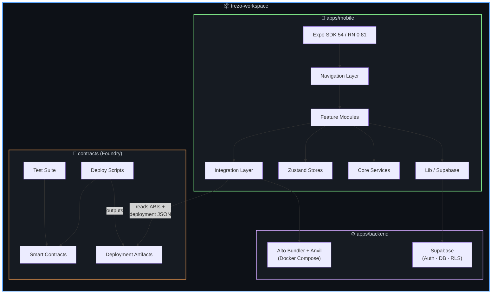
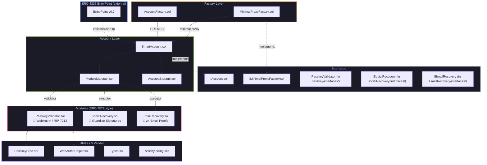
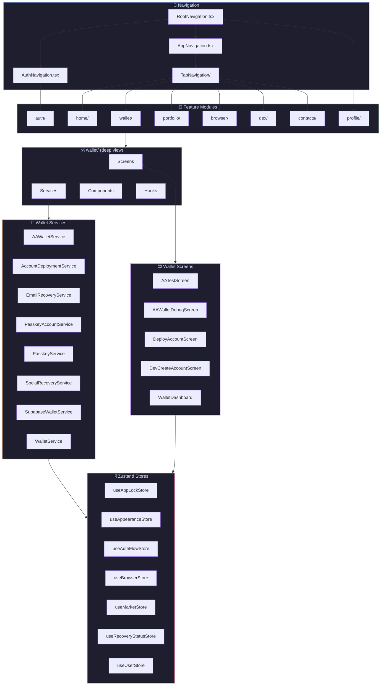
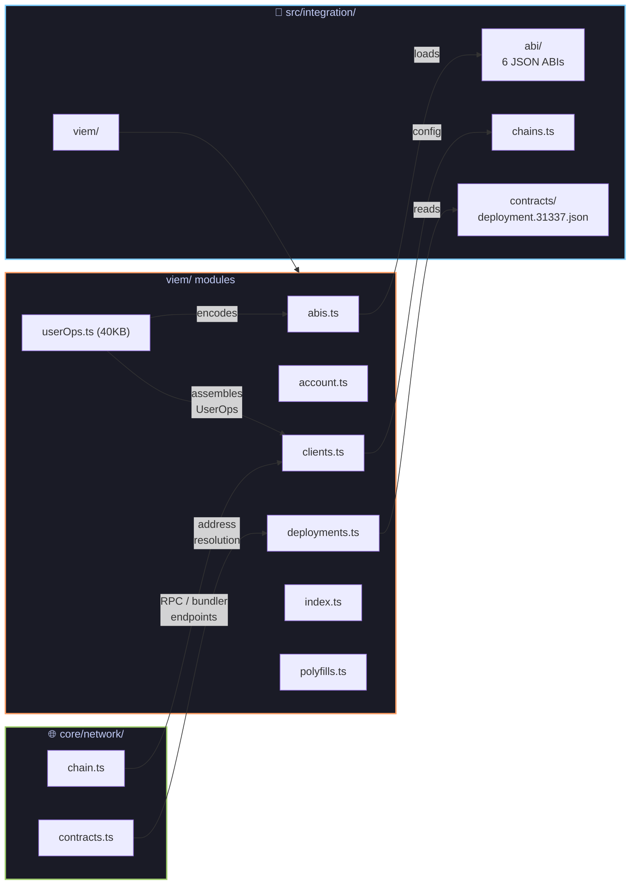
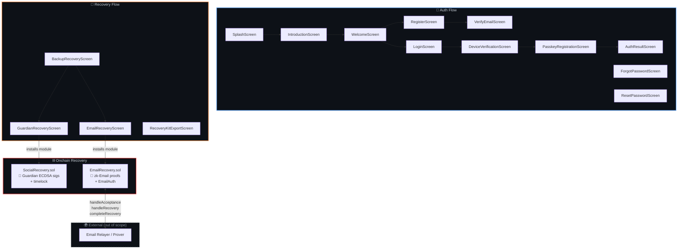
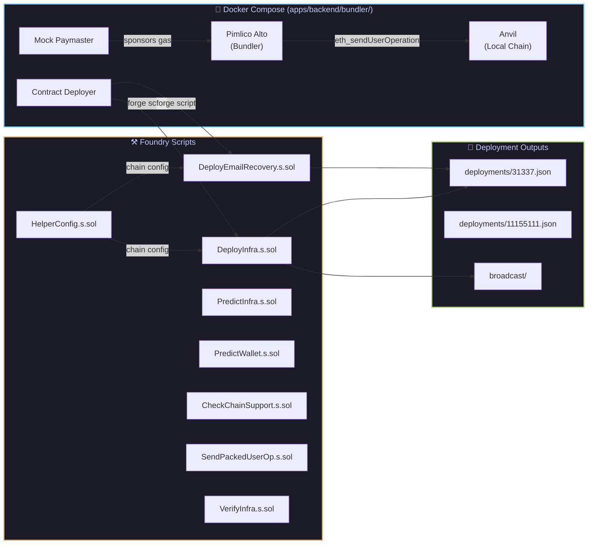
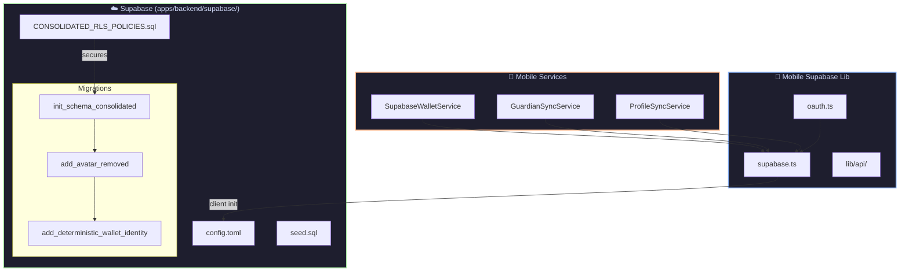
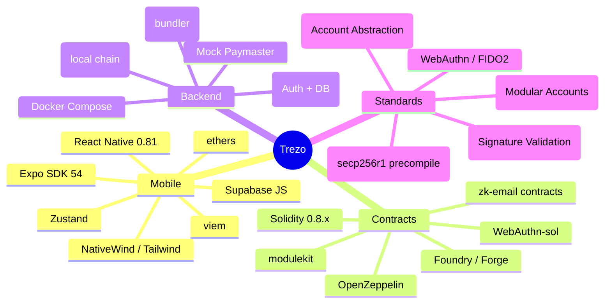

# 🏗️ Trezo Wallet — Architecture Graph

> **Passkey-first ERC-4337 smart contract wallet** — React Native Expo · Foundry · Supabase · Local AA Stack

---

## 1. System Overview



---

## 2. Smart Contract Architecture



---

## 3. Mobile App Architecture



---

## 4. Integration Layer — Contract Bridge



---

## 5. Auth & Recovery Flows



---

## 6. Local AA Development Stack



---

## 7. Supabase Backend



---

## 8. Test Coverage Map

```mermaid
graph TD
    subgraph UNIT_TESTS["🧪 Unit Tests"]
        T_ACS["AccountStorage.t.sol"]
        T_DWA["DebugWebAuthn.t.sol"]
        T_DES["DeployEmailRecoveryScript.t.sol"]
        T_DS["DeploymentScripts.t.sol"]
        T_DAM["DeterministicAddressModel.t.sol"]
        T_MIN["MinimalTest.t.sol"]
        T_MM["ModuleManager.t.sol"]
        T_UO["UserOperation.t.sol"]
    end

    subgraph MODULE_TESTS["🔬 Module Tests"]
        T_ER["EmailRecovery.t.sol"]
        T_PV["PasskeyValidator.t.sol"]
        T_SR["SocialRecovery.t.sol"]
    end

    subgraph INTEGRATION_TESTS["🔗 Integration Tests"]
        T_ERI["EmailRecoveryIntegration.t.sol"]
        T_SRI["SocialRecoveryIntegration.t.sol"]
    end

    T_ACS -->|"tests"| AS2["AccountStorage"]
    T_MM -->|"tests"| MM2["ModuleManager"]
    T_PV -->|"tests"| PV2["PasskeyValidator"]
    T_SR -->|"tests"| SR2["SocialRecovery"]
    T_ER -->|"tests"| ER2["EmailRecovery"]
    T_ERI -->|"e2e"| ER2
    T_SRI -->|"e2e"| SR2

    style UNIT_TESTS fill:#0d1117,stroke:#3fb950,stroke-width:2px,color:#c9d1d9
    style MODULE_TESTS fill:#0d1117,stroke:#d29922,stroke-width:2px,color:#c9d1d9
    style INTEGRATION_TESTS fill:#0d1117,stroke:#f85149,stroke-width:2px,color:#c9d1d9
```



---

## 9. Full File Tree

```
trezo/
├── 📄 package.json              (workspace root)
├── 📄 README.md
├── 📄 plan.md                   (roadmap + security addendum)
│
├── 📱 apps/
│   ├── mobile/                  (Expo SDK 54 / RN 0.81)
│   │   ├── App.tsx              (entry point)
│   │   ├── index.js
│   │   ├── app.config.ts
│   │   ├── package.json
│   │   └── src/
│   │       ├── app/
│   │       │   ├── components/
│   │       │   ├── hooks/
│   │       │   ├── navigation/
│   │       │   │   ├── RootNavigation.tsx
│   │       │   │   ├── AuthNavigation.tsx
│   │       │   │   ├── AppNavigation.tsx
│   │       │   │   ├── TabNavigation/
│   │       │   │   └── navigationRef.ts
│   │       │   └── wallet/
│   │       ├── core/
│   │       │   ├── auth/
│   │       │   │   ├── biometrics.ts
│   │       │   │   └── passkeys.ts       ⚠️ legacy mock
│   │       │   └── network/
│   │       │       ├── chain.ts
│   │       │       └── contracts.ts
│   │       ├── features/
│   │       │   ├── auth/   (11 screens)
│   │       │   ├── home/   (HomeScreen — 64KB)
│   │       │   ├── wallet/
│   │       │   │   ├── screens/  (5 screens)
│   │       │   │   ├── services/ (9 services)
│   │       │   │   ├── components/ (4 cards)
│   │       │   │   ├── hooks/  (useWallet)
│   │       │   │   ├── store/
│   │       │   │   └── types/
│   │       │   ├── profile/
│   │       │   │   ├── screens/ (7 screens)
│   │       │   │   ├── services/ (2 sync services)
│   │       │   │   └── types/
│   │       │   ├── portfolio/ (PortfolioScreen)
│   │       │   ├── browser/  (BrowserScreen)
│   │       │   ├── dex/      (DexScreen)
│   │       │   └── contacts/ (ContactsScreen)
│   │       ├── integration/
│   │       │   ├── abi/       (6 contract ABIs)
│   │       │   ├── chains.ts
│   │       │   ├── contracts/ (deployment JSON)
│   │       │   └── viem/
│   │       │       ├── abis.ts
│   │       │       ├── account.ts
│   │       │       ├── clients.ts
│   │       │       ├── deployments.ts
│   │       │       ├── polyfills.ts
│   │       │       └── userOps.ts  (40KB — UserOp assembly)
│   │       ├── lib/
│   │       │   ├── supabase.ts
│   │       │   ├── oauth.ts
│   │       │   └── api/
│   │       ├── store/         (7 Zustand stores)
│   │       ├── hooks/
│   │       ├── shared/components/
│   │       ├── theme/
│   │       ├── types/
│   │       └── utils/
│   │
│   └── backend/
│       ├── bundler/
│       │   ├── docker-compose.yml
│       │   ├── alto-config.json
│       │   ├── save-state.sh
│       │   └── restore-state.sh
│       └── supabase/
│           ├── config.toml
│           ├── seed.sql
│           ├── CONSOLIDATED_RLS_POLICIES.sql
│           └── migrations/ (3 SQL files)
│
└── 🔐 contracts/                (Foundry project)
    ├── foundry.toml
    ├── Makefile                  (deploy targets)
    ├── DEPLOYMENTS.md
    ├── context.md
    ├── remappings.txt
    ├── src/
    │   ├── account/
    │   │   ├── SmartAccount.sol       (14KB)
    │   │   ├── AccountStorage.sol
    │   │   └── managers/
    │   │       └── ModuleManager.sol  (11KB)
    │   ├── factory/
    │   │   └── AccountFactory.sol
    │   ├── proxy/
    │   │   └── MinimalProxyFactory.sol
    │   ├── modules/
    │   │   ├── passkey/
    │   │   │   ├── PasskeyValidator.sol  (17KB)
    │   │   │   └── interfaces/
    │   │   ├── SocialRecovery/
    │   │   │   ├── SocialRecovery.sol    (20KB)
    │   │   │   └── interfaces/
    │   │   └── EmailRecovery/
    │   │       ├── EmailRecovery.sol     (5KB)
    │   │       └── interfaces/
    │   ├── common/Types.sol
    │   ├── utils/
    │   │   ├── PasskeyCred.sol
    │   │   └── WebAuthnHelper.sol
    │   ├── interfaces/
    │   │   ├── IAccount.sol
    │   │   └── IMinimalProxyFactory.sol
    │   └── vendor/solidity-stringutils/
    ├── script/
    │   ├── DeployInfra.s.sol
    │   ├── DeployEmailRecovery.s.sol   (15KB)
    │   ├── HelperConfig.s.sol
    │   ├── PredictInfra.s.sol
    │   ├── PredictWallet.s.sol
    │   ├── SendPackedUserOp.s.sol      (11KB)
    │   ├── CheckChainSupport.s.sol
    │   ├── CheckRootFactory.s.sol
    │   ├── P256Signer.s.sol
    │   ├── VerifyInfra.s.sol
    │   ├── WebAuthnTools.s.sol
    │   └── common/
    ├── test/
    │   ├── AccountStorage.t.sol
    │   ├── DebugWebAuthn.t.sol
    │   ├── DeployEmailRecoveryScript.t.sol
    │   ├── DeploymentScripts.t.sol
    │   ├── DeterministicAddressModel.t.sol
    │   ├── MinimalTest.t.sol
    │   ├── ModuleManager.t.sol
    │   ├── UserOperation.t.sol
    │   ├── helpers/
    │   ├── modules/
    │   │   ├── EmailRecovery.t.sol
    │   │   ├── PasskeyValidator.t.sol
    │   │   └── SocialRecovery.t.sol
    │   └── integration/
    │       ├── EmailRecoveryIntegration.t.sol
    │       └── SocialRecoveryIntegration.t.sol
    └── deployments/
        ├── 31337.json        (local Anvil)
        ├── 11155111.json     (Sepolia)
        ├── chains/
        ├── local/
        ├── releases/
        ├── test/
        └── test-release/
```

---

## 10. Key Metrics

| Layer | Files | Largest File | Lines of Weight |
|-------|-------|-------------|-----------------|
| **Smart Contracts** (src/) | ~15 `.sol` | `SocialRecovery.sol` (20KB) | Core account + 3 modules |
| **Deploy Scripts** | 11 `.s.sol` | `DeployEmailRecovery.s.sol` (15KB) | Deterministic deploys |
| **Tests** | 13 `.t.sol` | `PasskeyValidator.t.sol` (20KB) | Unit + integration |
| **Mobile Screens** | ~25 `.tsx` | `HomeScreen.tsx` (64KB) | 8 feature modules |
| **Mobile Services** | 11 `.ts` | `userOps.ts` (40KB) | UserOp assembly engine |
| **Zustand Stores** | 7 stores | `useBrowserStore.ts` (10KB) | Global state mgmt |
| **Supabase** | 3 migrations | `init_schema` (38KB) | Auth + wallet data |
| **Docker/Bundler** | 5 files | `docker-compose.yml` | Local AA infra |

---

## 11. Technology Stack


